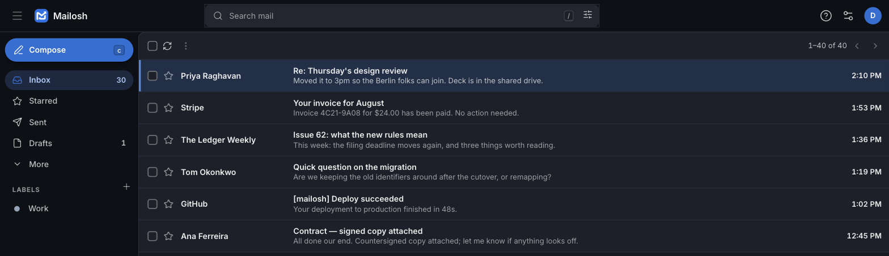

<h1>
  <picture>
    <source media="(prefers-color-scheme: dark)" srcset="docs/images/mailosh-wordmark-dark.png">
    
  </picture>
</h1>

[](CHANGELOG.md)
[](LICENSE)
[](pyproject.toml)
[](#development)

**Self-hosted webmail with Gmail's layout and shortcuts, on your own server.**
Mailosh is a keyboard-first mail client for the [Stalwart](https://stalw.art)
mail server. Python and HTML on the server, no Node toolchain, AGPL-3.0.



## Features

- **Reading** — conversation view with quoted text folded away. HTML mail is
  sanitised server-side and rendered in a sandboxed frame under its own CSP;
  remote images stay blocked until you allow them.
- **Compose** — rich text, autosaved drafts, attachments, reply / reply all /
  forward with proper threading, and a ten-second undo on send.
- **Search** with Gmail operators: `from: to: subject: has: is: in: label:
  before: after: older_than: newer_than: larger: smaller:`, quotes, `-`, `OR`.
- **Labels** — create, rename, nest, colour; apply several at once. Labels are
  JMAP mailboxes, so other clients see them too.
- **Triage with undo** — archive, delete, spam, star, read/unread, in bulk,
  each with a ten-second undo toast.
- **Keyboard-first** — `j` `k` `o` `e` `#` `x` `z` `c` `r` `/` and friends,
  `g`-jumps, and a `⌘K` command palette. `?` shows them all.
- **Live updates** over SSE, light and dark themes, three densities, a
  mobile layout, WCAG 2.2 AA.

Each user signs in with their Stalwart credentials. Mailosh keeps a
per-session Stalwart API key encrypted at rest; it never stores passwords.

## Quick start

You need Docker with Compose, Python 3.12+, `make` and `curl`.

```bash
git clone https://github.com/manish-sharmaa/Mailosh.git mailosh && cd mailosh
make venv
cp .env.example .env            # set MAILOSH_STALWART_ADMIN_SECRET, MAILOSH_SECRET_KEY,
                                # MAILOSH_DEMO_PASSWORD (generators are in the file)
make up                         # stalwart + postgres + mailosh
bash scripts/stalwart-init.sh   # creates the dev domain and a demo mailbox
```

Open <http://localhost:8000> and sign in as `demo@mailosh.test` with the
demo password. Everything is bound to `127.0.0.1`.

## Deploying

The development stack above is not for the internet. For a real server use
the production overlay, which puts Caddy in front (automatic HTTPS), keeps
Postgres and Stalwart's admin API on internal networks, and publishes only
`80`, `443`, `25`, `465`, `587` and `993`.

1. Point `app.<domain>` and `mail.<domain>` at the box (A/AAAA), add an MX
   for `<domain>` → `mail.<domain>`, and set the box's reverse DNS to
   `mail.<domain>`.
2. Fill the *Production deployment* block of `.env`
   (`MAILOSH_SITE_ADDRESS`, `MAILOSH_ACME_EMAIL`, `MAILOSH_PG_PASSWORD`).
3. Bring it up and configure Stalwart:

   ```bash
   export COMPOSE_FILE=docker-compose.yml:docker-compose.prod.yml
   docker compose config          # refuses to continue if anything is unset
   docker compose up -d --build
   scripts/stalwart-bootstrap.sh --domain <domain>
   docker compose exec -T mailosh mailosh setup --domain <domain> --email you@<domain>
   ```

   `mailosh setup` creates your first mailbox and prints the SPF, DKIM and
   DMARC records to publish.

[`docs/operations.md`](docs/operations.md) covers the rest: mail-port TLS via
DNS-01, backups and restore, upgrades, and what to check when something is
off. [`docs/hosting.md`](docs/hosting.md) compares hosts and explains the
outbound-port-25 situation most VPS providers put you in.

A 2 GB VPS is plenty for a few people.

## Configuration

Everything is a `MAILOSH_*` environment variable read from `.env`.
[`.env.example`](.env.example) documents each one; the ones you will
actually touch:

| Variable | Purpose |
| --- | --- |
| `MAILOSH_STALWART_ADMIN_SECRET` | Stalwart's admin password, used to mint per-user API keys |
| `MAILOSH_SECRET_KEY` | ≥ 32 random chars; root key for session encryption and undo tokens |
| `MAILOSH_SITE_ADDRESS` | Webmail hostname Caddy serves and certifies (production) |
| `MAILOSH_ACME_EMAIL` | Where certificate-expiry warnings go — not an inbox on this server |
| `MAILOSH_PG_PASSWORD` | Postgres password (production) |
| `MAILOSH_SESSION_IDLE_DAYS` / `_REMEMBER_DAYS` / `_ABSOLUTE_DAYS` | Session lifetimes; defaults 14 / 30 / 90 |

Mailosh runs one worker on purpose: sign-out revokes the session's mail
client in-process, and scaling out needs cross-process revocation first.

## Development

```bash
make dev      # live reload: bind-mounted source, uvicorn --reload
make css      # recompile styles/input.css after editing it
make test     # unit tests, no stack needed
make itest    # integration tests against the running stack
.venv/bin/ruff check . && .venv/bin/ruff format --check .
```

The frontend is Jinja templates swapped by **htmx**, **Alpine** (CSP build)
for small local state, and our own JavaScript modules for the keyboard
registry, palette, actions and SSE. Frontend libraries, icons and the font
are fetched and pinned by the Makefile — there is no `package.json` — and
the app serves `script-src 'self'` with no `unsafe-eval`.

```
mailosh/web/        routes, templates, static JS
mailosh/jmap/       JMAP client and models
mailosh/services/   thread list, actions, labels, search, undo
mailosh/security/   sessions, CSRF, crypto, rate limiting
mailosh/render/     HTML mail sanitising and the message frame
styles/input.css    Tailwind 4 source
scripts/            bootstrap, backup, restore, health check
docs/               operations, hosting, design specs
tests/              unit/ and integration/
```

## Roadmap

Settings pages, snooze and scheduled send, contacts and calendar, and
multi-account are next. Design documents live in [`docs/specs`](docs/specs).

## Contributing and security

Bug reports and patches are welcome — see [`CONTRIBUTING.md`](CONTRIBUTING.md)
for setup and the few deliberate constraints (no Node, pinned assets, strict
CSP). For security issues please follow [`SECURITY.md`](SECURITY.md) rather
than opening a public issue.

## License

[AGPL-3.0-or-later](LICENSE). Vendored frontend assets and their licenses
are listed in [`NOTICE`](NOTICE).
